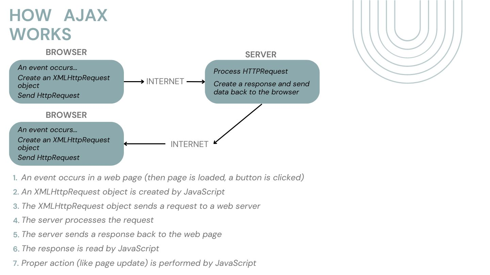
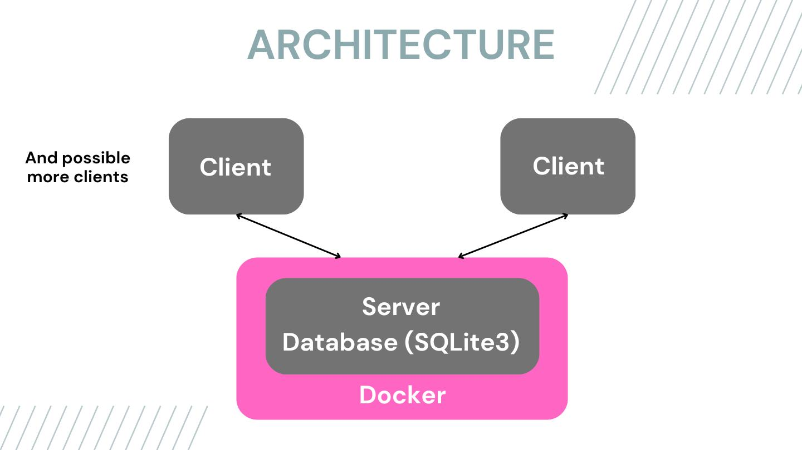

# Industry track

## Battleship the Game

## About the project
By Ville Ailunka, Juuso Herajärvi and Juuso Särkelä

The application is a 1vs1 Battleships game playable in the browser.

## Implemented components:
The game implements Client-Server architecture:
- The system consists of a server which holds, authentication, taking commands from clients, creating matches between clients.
- For playing a game you need at least two clients connected to server, in client you will give input and it will send to client handle requests.
    -When creating game server creates a new thread for each game.

Participating nodes exchange information through Flask API and Ajax.


Each node must be an independent entity and (partially) autonomous


Detailed descriptions of relevant principles covered in the course (architecture, processes, communication, naming, synchronization, consistency and replication, fault tolerance); irrelevant principles can be left out.

As we said we used server-client architecture, where data base

## Built with:
Detailed description of the system functionality and how to run the implementation

We use Docker for setting up the container for our server.
SQLite3 for the database.
Used programming languages: Python, Html, SQL, CSS, JavaScript

- If you are familiar with a particular container technology, feel free to use it (Docker is not mandatory)
- Any communication protocol / Internet protocol suite can be used: HTTP(S), MQTT, AMQP, CoAP, ..

## Getting Started:
Our application requires Docker to run.
Clone the repository and go to the Distributed_Systems_project folder.

Start the application with (it downloads all the requirements):
```console
$ docker compose up
```

Then go to http://127.0.0.1:5000 to access the game interface.


## Results of the tests:
Detailed description of the system evaluation
Evaluate your implementation using selected criteria, for example:
- Number of messages / lost messages, latencies, ...
- Request processing with different payloads, ..
- System throughput, ..

- We are aware of SQLite3's nonconcurrency so if we were to make the program more scalable, we would just switch to using MySQL, which supports concurrency operations. We chose SQLite3 for it's lightweight quality.


Design two evaluation scenarios that you compare with each other, for example:
- Small number / large number of messages
- Small payload / big payload

Collect numerical data of test cases:
- Collecting logs of container operations
- Conduct simple analysis for documentation purposes (e.g. plots or graphs)

## Acknowledgments:
list resources you find helpful


In the world of gaming, there is no bound for innovation. From the humble beginnings of pixelated adventures to the immersive virtual realities of today, the landscape constantly evolves. One such evolution is the advent of distributed systems, reshaping how we interact with and experience multiplayer games. Among these, the timeless classic Battleship emerges as a prime candidate for a distributed makeover, weaving together nostalgia and cutting-edge technology into a seamless naval warfare experience.

1  Our solution

This chapter will tell you about our solution how we created a online battleship game to play againsts random people from all around world. We used simple client – server achitecture to create a classic battleship game experience for user to play. Participating nodes exchange information through Flask API and Ajax



1.1	Server

The server have  multiple tasks to do, first when player is connecting to server user is asked to login or register depending on do they have already existing account. After registering or log in server we check from database is inside server that does user exist or credentials depending if user is registering or logging in. Database is implemented with sqlite3. Server also handles setting ships on board, shooting and game logic. When player is ready to play matchmaking thread set it to matchamaking queue, when queue has two people it will take first two out there and create a game thread for users.

1.2	Client

In client node users have to give their credentials or registering in registering their desired credentials, after that clients send request to server if that are they authorizes and will sent back HTML file depending result of authorize. After logged in user is asked to create a board where user chooses first which way he want the first ship to be in board, then he chooses a coordination where ship will be, in here Javascript code will check if he can place the ship there. This will happen until all ships are placed, after that client send request to server that he is ready for game. When game is started user will click coordinates where he want to shoot, and it will send server that coordination.





2 Scalability

If there is a lot of users who are trying to login or register, we are aware of SQLite3's nonconcurrency so if we were to make the program more scalable, we would just switch to using MySQL, which supports concurrency operations. We chose SQLite3 for it's lightweight quality. For each game server will create a thread so this is not a problem if there are not too many threads so basically it depeds on hardware.


3 Princibles

Architecture:
The system is designed to operate in a client-server architecture where Flask serves as the server, handling HTTP requests from clients.
Threading is utilized to handle concurrent tasks, such as matchmaking and gameplay, enhancing scalability.

Processes:
The server-side processes include matchmaking, gameplay, and handling HTTP requests for user interaction.

Communication:
Communication between the client and server occurs over HTTP using Flask routes for various actions such as logging in, registering, setting up the game, and making moves.

Naming:
Meaningful variable and function names are used throughout the code, enhancing readability and maintainability.

Synchronization:
Threading mechanisms, are employed to ensure thread safety, particularly in scenarios where shared resources (e.g. matchmaking queue) are accessed concurrently.

Consistency and Replication:
The code focuses on maintaining consistency in game state and user data. For example, after a successful login, user session data is managed to maintain consistency across requests. Replication techniques are not explicitly implemented in code snippet, as it primarily focuses on the core functionality of the Battleship game.

Fault Tolerance:
The code demonstrates fault tolerance by using error handling mechanisms, such as try-except blocks, to handle exceptions and errors that may occur during database operations or other critical tasks.
